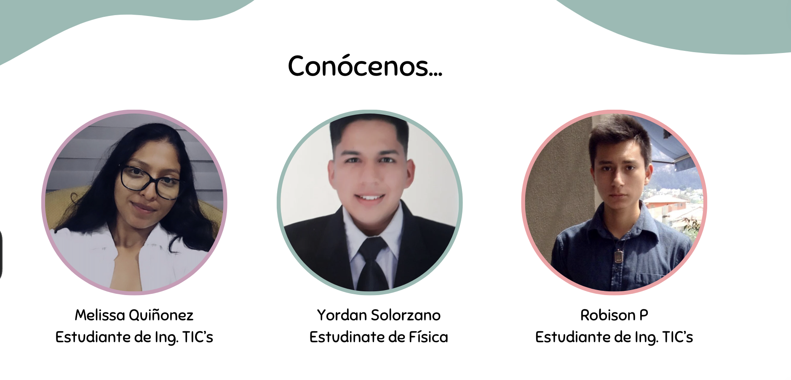
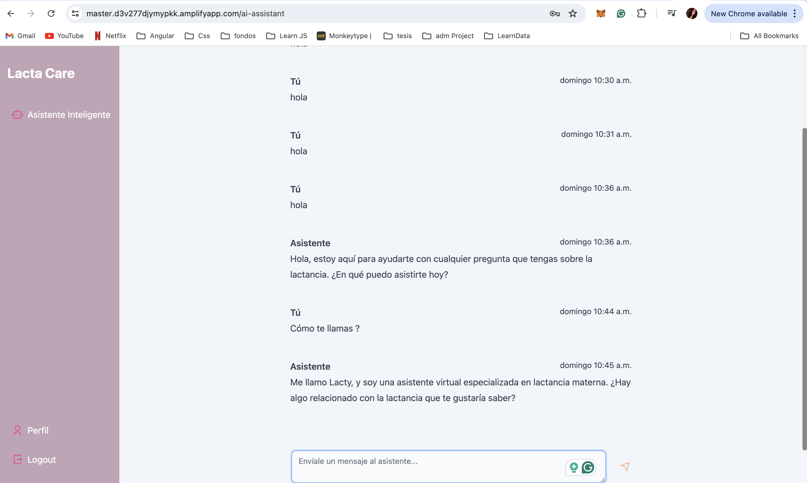

# CoAfina 2024 – LataCare – Lacty (Asistente Virtual)

**Equipo:** Physics Daemons 

**Nombre de la Página:** LataCare

**Nombre del Assitente:** Lacty

**Quienes Somos:** Melissa, Yordan y Robinson. Un equipo multidisciplianrio de la Universidad Yachay Tech Ecuador, y actualmente nos encontramos en nuestro último año de la universidad. 

[Lacty](https://master.d3v277djymypkk.amplifyapp.com/ai-assistant/) es un asistente virtual diseñado para ayudar a los profesionales de la salud a responder preguntas en múltiples idiomas, utilizando documentos oficiales de la Organización Mundial de la Salud (WHO) como fuente principal de información. En **LataCare**, creemos que el acceso a información precisa y multilingüe es crucial para mejorar la atención médica en todo el mundo.

[1. Planteamiento del Problema](#1-planteamiento-del-problema)

[2. Objetivo](#2-objetivo)

[3. Descripción Solución](#3-descripción-solucióncaso)

[4. Pitch](#4-pitch)

[6. Código Proyecto](#6-código-proyecto)

[7. Documentos Adicionales](#7-documentos-adicionales-opcional)

## 1. Planteamiento del Problema

El acceso a información médica precisa y multilingüe es un desafío significativo para los profesionales de la salud, especialmente en regiones con diversidad lingüística. Las barreras idiomáticas pueden dificultar la comprensión y aplicación de directrices médicas cruciales, lo que puede afectar negativamente la calidad de la atención médica. Además, la falta de acceso a documentos oficiales y actualizados puede llevar a la difusión de información errónea.

## 2. Objetivos
### Objectivo General
Desarrollar un asistente virtual multilingüe que utilice documentos oficiales de la WHO para proporcionar respuestas precisas y actualizadas a los profesionales de la salud.

### Objetivos Específicos 
* Implementar Lacty como una plataforma central para recopilar y traducir documentos médicos oficiales de la WHO.

* Proporcionar respuestas en tiempo real a preguntas médicas en múltiples idiomas, facilitando decisiones informadas.

* Asegurar que la información proporcionada esté basada en documentos oficiales y actualizados de la WHO.

* Facilitar el acceso a directrices médicas precisas y multilingües para mejorar la calidad de la atención médica global.

* Establecer mecanismos de actualización continua para garantizar la relevancia y precisión de la información proporcionada.

## 3. Descripción de la Solución
[Lacty](https://master.d3v277djymypkk.amplifyapp.com/ai-assistant/) es una aplicación diseñada para ayudar a los profesionales de la salud a obtener respuestas precisas y en tiempo real a preguntas médicas en múltiples idiomas. Utilizamos documentos oficiales de la WHO como fuente principal de información.

## 4. Código Proyecto
El proyecto está dividido en dos secciones principales:

### Aplicación (Front-end)
Para la aplicación front-end se utilizó como tecnología principal **React** con **TypeScript**. Adicional a esto esta integrada con servicios de **AWS** a través de **AWS Amplify** lo que le otorga a la aplicación característica **SERVERLESS** y una escalamiento casi ilimitado. Esta desplegada en **AWS** e incluye un sistema **CI/CD** para agilizar el desarrollo y la puesta en producción. 

### Aplicación (Back-end)
La aplicación es 100% SERVERLESS apoyada de servicios de AWS como **AWS Amplify, AWS Lambda** entre otros. Esto hace que su escalamiento y mantencion se traduzcan en costos muy asequibles y garantiza también completa proteccion y privacidad de los datos garcias a las tecnologías de AWS.

## 5. Documentos Adicionales

[Canvas](https://www.canva.com/design/DAGLhOas4Ec/rb2GZqqfWRAVvRuMzomf9g/edit?utm_content=DAGLhOas4Ec&utm_campaign=designshare&utm_medium=link2&utm_source=sharebutton) diapositivas del proyecto.
